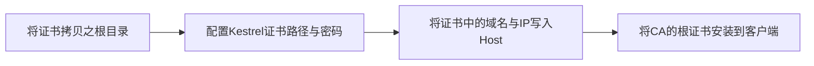

### https交互过程示意图

```sequence
Client --> Server: 
Server ->> CA:1.申请证书
CA --> CA: 2.私钥加密server的公钥，形成证书
CA -->Server: 3.给Server颁发证书
Client ->> Server: 4.索要服务端证书
Server --> Client:5.返回证书
Client ->>Client:6.使用预先安装的CA的公钥解密证书，得到Server的公钥
Client ->> Server: 7.使用公钥加密传输信息，随机数，开始协商
Server --> Client:8.协商出一个与客户端特有的密钥
Client ->> Server: 9.开始使用该密钥进行对称加密通讯
```


### 自签名证书

1. 首先虚拟出一个CA认证机构

```bash
# 生成CA认证机构的证书密钥key
# 需要设置密码，输入两次
openssl> genrsa -des3 -out ca.key 1024

# 去除密钥里的密码(可选)
# 这里需要再输入一次原来设的密码
openssl> rsa -in ca.key -out ca.key

# 用私钥ca.key生成CA认证机构的证书ca.crt
# 其实就是相当于用私钥生成公钥，再把公钥包装成证书
openssl> req -new -x509 -key ca.key -out ca.crt -days 365
# 这个证书ca.crt有的又称为"根证书",因为可以用来认证其他证书
```

2. 生成网站的证书

``` bash
# 生成自己网站的密钥server.key
openssl> genrsa -des3 -out server.key 1024

# 生成自己网站证书的请求文件
# 如果找外面的CA机构认证，也是发个请求文件给他们
# 这个私钥就包含在请求文件中了，认证机构要用它来生成网站的公钥，然后包装成一个证书
openssl> req -new -key server.key -out server.csr

# 使用虚拟的CA认证机构的证书ca.crt，来对自己网站的证书请求文件server.csr进行处理，生成签名后的证书server.crt
# 注意设置序列号和有效期（一般都设1年）
openssl> x509 -req -in server.csr -CA ca.crt -CAkey ca.key -set_serial 01 -out server.crt -days 365
```

3. 解决Chrome不能识别证书通用名称NET::ERR_CERT_COMMON_NAME_INVALID错误

```bash
vim http.ext
keyUsage = nonRepudiation, digitalSignature, keyEncipherment
extendedKeyUsage = serverAuth, clientAuth
subjectAltName=@SubjectAlternativeName
[ SubjectAlternativeName ]
DNS.1=test.com
DNS.2=www.test.com
#重新生成证书
openssl> x509 -req -in server.csr -CA ca.crt -CAkey ca.key -set_serial 01 -out server.crt -days 3650 -extfile http.ext
```

### Asp.Net Core中使用证书




*上述第四步非必须，但是浏览器会提示无法验证证书的合法性*

```c#
 public static void Main(string[] args)
        {
            var host = new WebHostBuilder()
               .UseKestrel(option => {
                   var certificate = new X509Certificate2("server.pfx", "123456");
                   option.ConfigureHttpsDefaults(options => { options.ServerCertificate = certificate; });
               })
               .UseUrls("https://*:443")
               .UseContentRoot(Directory.GetCurrentDirectory())
               .UseIISIntegration()
               .UseStartup<Startup>()
               .Build();

            host.Run();
        }

```


>参考文档
>
>https://www.jianshu.com/p/0e9ee7ed6c1d
>
>https://www.bilibili.com/video/BV1w4411m7GL?t=1012
>
>https://www.icode9.com/content-4-574941.html#%E9%99%84%E5%8A%A0%E7%94%A8%E9%80%94

