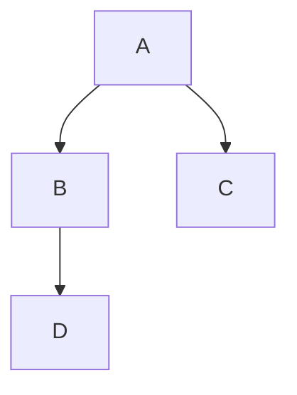

### 1.功能键

---

- Ctrl+/ 预览模式与源码模式切换
- Ctrl+Shift++/- 放大/缩小视图
- Ctrl+N 新建文档
- Ctrl+HOME 跳轉到開頭
- Ctrl+END 跳轉到末尾
- \ 转义，原样输出，禁止 Typora 解析
- ctrl+shift+f 全局搜索
- ctrl+L 选中当前行

### 2.编辑

---

#  N 级标题(Ctrl+N )

 正文文本(Ctrl+0)

** 加粗**(Ctrl+b)

```
** 加粗**
```

 <u> 下划线 </u>(Ctrl+u)

```
<u>下划线</u>

```

*斜体*（Ctrl+i）

```
*斜体*

```

==高亮显示==

```
==高亮显示==

```

```
 插入代码块(Ctrl+shift+k)
```

- 输入一个减号+空格，生成无序列表

1. 输入一个数字加点+空格，生成有序列表

任务列表

```
- [ ] 001

- [ ] 002

```

- [ ] 001
- [ ] 002

 [插入超链接](http://www.baidu.com)(Ctrl+k)

```
 [超鏈接上顯示的文字](http://www.baidu.com)

```

 插入表格（ Ctrl+T）

```
|      |      |      |
| ---- | ---- | ---- |
|      |      |      |

```

|      |      |      |
| ---- | ---- | ---- |
|      |      |      |

>  插入引用 (Ctrl+shift +q)
>
> '>' 大鱼号生成下级引用
>
> > 二级引用

 插入图片(Ctrl+shift+i)

```


```


三个星号、减号 生成分割线

```
***
---

```

***
---

- Ctrl+D 选中当前词语 
- Ctrl+L 选中当前行 
- Ctrl+F 查找
- Ctrl+H 替換

### 3.Typora 自定义的

1. 上标 X^2^

2. 下标 H~2~0

3. ==高亮显示==

4. emoji ​,​输入​冒号​：​然后​选择: upside_down_face: : dog:

5. 生成目录 [toc]

    

   [toc]

6. 

### 4.画图

- 流程图

```
graph TD; 
A-->B;
A-->C;
B-->D;
```




- 时序图

```
alice ->>john: hello john
john ->> tim: hello tim
john ->>alice: hello alice
```


```sequence
alice ->>john: hello john
 john ->> tim: hello tim
john ->>alice: hello alice
```


# 偏好设置

## 默认图片左对齐


```css
p .md-image:only-child{
    width: auto;
    text-align: left;
}
```

# 安装插件

[GitHub - obgnail/typora_plugin: Typora plugin. Feature enhancement tool | Typora 插件，功能增强工具](https://github.com/obgnail/typora_plugin)


# 找回license

https://store.typora.io/my
